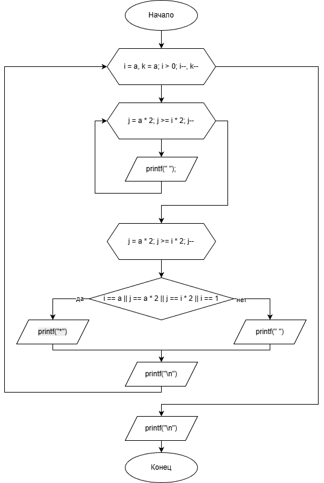

# Домашнее задание

## Условие задачи
Написать программу, выводящую на экран заданную геометрическую фигуру, нарисованную с помощью заданного с клавиатуры символа. 
Предусмотреть возможность изменения размеров фигуры путем задания ее размеров в количестве символов пользователем.


## 1. Алгоритм и блок-схема

### Алгоритм
1. **Начало**
2. Инициализировать переменные:
   - `a` (int) - размер фигуры, вводимый пользователем
3. Запросить у пользователя значение `a`
4. Для каждого уровня `i`:
   - Вывести нужное количество пробелов для формирования треугольника
   - Для каждой позиции в строке определить:
     - Если это граница фигуры (первая/последняя строка, левая/правая граница), вывести `*`
     - Иначе вывести пробел
5. Перейти на новую строку
6. Вывести пустую строку для разделения
7. **Конец**

### Блок-схема


[https://github.com/glebofrl/labVSU/blob/master/scheme.png](https://github.com/glebofrl/lab9VSTU/blob/master/scheme.png)

## 2. Реализация программы

```
#include <stdio.h>
#include <locale.h>
#include <math.h>

void main()
{
    setlocale(LC_CTYPE, "RUS");
    
    int a;
    printf("Введите размер треугольника: ");
    scanf("%d", &a);

    for (int i = a, k = a; i > 0; i--, k--)
    {
        for (int j = k; j > 1; j--)
        {
            printf(" ");
        }

        for (int j = a * 2; j >= i * 2; j--)
        {
            if (i == a || j == a * 2 || j == i * 2 || i == 1)
                printf("*");
            else 
                printf(" ");
        }

        printf("\n");
    }
    
    printf("\n");
    system("pause");
}
```
## 3. Результаты работы программы


## 4. Информация о разработчике

Глебов Илья, бИПТ-252
